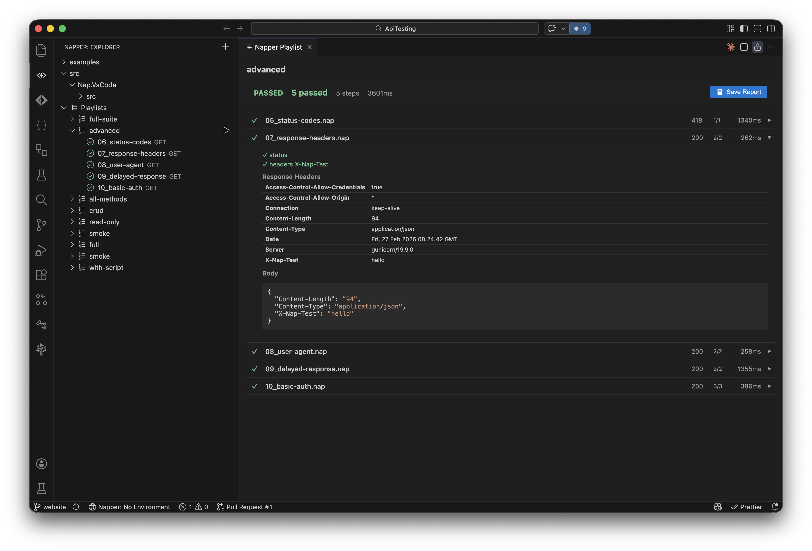

<p align="center">
  
</p>

<h1 align="center">Napper</h1>

<p align="center">
  <strong>API Testing, Supercharged.</strong><br>
  Napper is a free, open-source API testing tool that runs from the command line and integrates natively with VS Code.
  Define HTTP requests as plain text <code>.nap</code> files, add declarative assertions, chain them into test suites, and run everything in CI/CD with JUnit output.
  As simple as curl for quick requests. As powerful as F# and C# for full test suites.
</p>

<p align="center">
  <a href="https://marketplace.visualstudio.com/items?itemName=Nimblesite.napper">VS Code Marketplace</a> &middot;
  <a href="https://napperapi.dev">Website</a> &middot;
  <a href="https://napperapi.dev/docs/">Documentation</a> &middot;
  <a href="https://github.com/MelbourneDeveloper/napper/releases">Releases</a>
</p>

---

<p align="center">
  
</p>

---

## What can Napper do?

Everything you need for API testing. Nothing you don't.

- **CLI First** (`cli-run`) &mdash; The command line is the product. Run requests, execute test suites, and integrate with CI/CD pipelines from your terminal.
- **VS Code Native** (`vscode-extension`) &mdash; Full extension with syntax highlighting (`vscode-syntax`), request explorer (`vscode-explorer`), environment switching (`vscode-env-switcher`), and Test Explorer integration (`vscode-test-explorer`). Never leave your editor.
- **F# and C# Scripting** (`script-fsx`, `script-csx`) &mdash; Full power of F# and C# for pre/post request hooks. Extract tokens, build dynamic payloads, orchestrate complex flows with the entire .NET ecosystem.
- **Declarative Assertions** (`nap-assert`) &mdash; Assert on status codes (`assert-status`), JSON paths (`assert-equals`, `assert-exists`), headers (`assert-contains`), and response times (`assert-lt`) with a clean, readable syntax. No scripting required for simple checks.
- **Composable Playlists** (`naplist-file`) &mdash; Chain requests into test suites with `.naplist` files. Nest playlists (`naplist-nested`), reference folders (`naplist-folder-step`), pass variables between steps (`naplist-var-scope`).
- **OpenAPI Import** (`openapi-generate`) &mdash; Generate test files from any OpenAPI spec. Point it at a file, and Napper creates `.nap` files with requests, headers, bodies, and assertions. Optionally enhance with AI via GitHub Copilot (`vscode-openapi-ai`).
- **Plain Text, Git Friendly** (`nap-file`) &mdash; Every request is a `.nap` file. Every environment is a `.napenv` file (`env-file`). Version control everything. No binary blobs, no lock-in.

## Installation

### VS Code Extension

Install from the marketplace in one command:

```sh
code --install-extension nimblesite.napper
```

Or search **"Napper"** in the VS Code Extensions panel (`Ctrl+Shift+X` / `Cmd+Shift+X`) and click Install.

To install a specific `.vsix` manually: open the Extensions panel → `...` menu → **Install from VSIX...**.

> **Requirements:** VS Code 1.95.0 or later. The extension shells out to the CLI, so install the CLI binary too.

### CLI Binary

The CLI is a self-contained binary with **no runtime dependencies**.

| Platform | Download |
|----------|----------|
| macOS (Apple Silicon) | [`napper-osx-arm64`](https://github.com/MelbourneDeveloper/napper/releases/latest/download/napper-osx-arm64) |
| macOS (Intel) | [`napper-osx-x64`](https://github.com/MelbourneDeveloper/napper/releases/latest/download/napper-osx-x64) |
| Linux (x64) | [`napper-linux-x64`](https://github.com/MelbourneDeveloper/napper/releases/latest/download/napper-linux-x64) |
| Windows (x64) | [`napper-win-x64.exe`](https://github.com/MelbourneDeveloper/napper/releases/latest/download/napper-win-x64.exe) |

**macOS / Linux:**
```sh
chmod +x napper-osx-arm64
mv napper-osx-arm64 /usr/local/bin/napper
napper --version
```

**Install script (macOS / Linux):**
```sh
curl -fsSL https://raw.githubusercontent.com/MelbourneDeveloper/napper/main/scripts/install.sh | bash
```

**Install script (Windows PowerShell):**
```powershell
irm https://raw.githubusercontent.com/MelbourneDeveloper/napper/main/scripts/install.ps1 | iex
```

**Build from source** (requires .NET SDK + `make`):
```sh
git clone https://github.com/MelbourneDeveloper/napper.git && cd napper && make install-binaries
```

> **Note:** F# (`.fsx`) and C# (`.csx`) script hooks require the [.NET 10 SDK](https://dotnet.microsoft.com/download). Plain `.nap` and `.naplist` files need nothing extra.

See the [full installation guide](https://napperapi.dev/docs/installation/) for VSIX manual install, troubleshooting, and macOS Gatekeeper notes.

## Quick Start

## How do you use Napper?

### Minimal request (`nap-minimal`)

A `.nap` file can be as simple as one line:

```
GET https://httpbin.org/get
```

### POST with body and assertions (`nap-body`, `nap-assert`)

```
[request]
POST {{baseUrl}}/posts

[request.headers]
Content-Type = application/json
Accept = application/json

[request.body]
"""
{
  "title": "Nap Integration Test",
  "body": "This post was created by the Nap API testing tool",
  "userId": {{userId}}
}
"""

[assert]
status = 201
body.id exists
body.title = Nap Integration Test
body.userId = {{userId}}
```

### Full request with metadata and scripting (`nap-full`)

```
[meta]
name = Get user by ID
description = Fetches a single user and asserts shape
tags = users, smoke

[vars]
userId = 42

[request]
GET https://api.example.com/users/{{userId}}

[request.headers]
Authorization = Bearer {{token}}
Accept = application/json

[assert]
status = 200
body.id = {{userId}}
body.name exists
headers.Content-Type contains "json"
duration < 500ms

[script]
pre = ./scripts/auth.fsx
post = ./scripts/validate-user.fsx
```

### Run from CLI

```sh
# Run a single request
napper run ./health.nap

# Run a full test suite
napper run ./smoke.naplist

# With environment + JUnit output
napper run ./tests/ --env staging --output junit
```

## What file formats does Napper use?

| Extension | Spec ID | Purpose | Example |
|-----------|---------|---------|---------|
| `.nap` | `nap-file` | Single HTTP request with optional assertions and scripts | `get-users.nap` |
| `.naplist` | `naplist-file` | Ordered playlist of steps (requests, scripts, nested playlists) | `smoke.naplist` |
| `.napenv` | `env-base` | Environment variables (base config, checked into git) | `.napenv` |
| `.napenv.local` | `env-local` | Local secrets (gitignored) | `.napenv.local` |
| `.napenv.<name>` | `env-named` | Named environment | `.napenv.staging` |
| `.fsx` | `script-fsx` | F# scripts for pre/post hooks and orchestration | `setup.fsx` |
| `.csx` | `script-csx` | C# scripts for pre/post hooks and orchestration | `setup.csx` |

### Playlists

```
[meta]
name = JSONPlaceholder CRUD
description = Full create-read-update-delete lifecycle for posts

[steps]
../scripts/setup.fsx
./01_get-posts.nap
./02_get-post-by-id.nap
./03_create-post.nap
./04_update-post.nap
./05_patch-post.nap
./06_delete-post.nap
../scripts/teardown.fsx
```

### Environments (`env-resolution`)

**`.napenv`** (base, checked into git):
```
baseUrl = https://jsonplaceholder.typicode.com
userId = 1
postId = 1
```

**`.napenv.local`** (secrets, gitignored):
```
token = eyJhbGci...
apiKey = sk-secret-key
```

Select a named environment with `--env`:
```sh
napper run ./smoke.naplist --env staging
```

Variable priority (highest wins):
1. `--var key=value` CLI flags (`cli-var`)
2. `.napenv.local` (`env-local`)
3. `.napenv.<name>` named environment (`env-named`)
4. `.napenv` base (`env-base`)
5. `[vars]` in `.nap`/`.naplist` files (`nap-vars`)

## OpenAPI Import

Generate `.nap` test files automatically from any OpenAPI or Swagger spec. Napper creates one file per operation, a `.naplist` playlist, and a `.napenv` environment file — giving you a working test suite in seconds.

**Supported formats:** OpenAPI 3.0.x, OpenAPI 3.1.x, Swagger 2.0 (JSON input).

### From the CLI

```sh
# Generate from a local spec file
napper generate openapi ./petstore.json --output-dir ./tests

# Output a JSON summary for scripting
napper generate openapi ./spec.json --output-dir ./tests --output json
```

### From VS Code

Open the Command Palette (`Ctrl+Shift+P` / `Cmd+Shift+P`) and choose:

- **Napper: Import OpenAPI from URL** &mdash; paste a URL (e.g. `https://petstore3.swagger.io/api/v3/openapi.json`). Napper downloads the spec and generates files.
- **Napper: Import OpenAPI from File** &mdash; browse to a local `.json` spec file.

Both commands prompt for an output folder and offer basic or AI-enhanced generation.

### What gets generated

Endpoints are grouped into subdirectories by API tag:

```
tests/
├── pets/
│   ├── get-pets.nap
│   ├── post-pets.nap
│   └── get-pets-petId.nap
├── store/
│   └── get-store-inventory.nap
├── petstore.naplist
└── .napenv
```

Each `.nap` file includes the method, URL (with path params as `{{variables}}`), auth headers, request body (from schema), and status code assertions. The `.napenv` file contains the base URL from the spec's `servers` field and variable placeholders for auth tokens.

### AI Enhancement (optional)

With GitHub Copilot available, choose AI-enhanced generation to get:

- Semantic assertions beyond status codes (e.g. `body.email contains @`)
- Realistic test data in request bodies instead of placeholder values
- Logical playlist ordering (auth first, then CRUD in dependency order)

Falls back to basic generation automatically if Copilot is unavailable.

See the [full OpenAPI import guide](https://napperapi.dev/docs/openapi-import/) for authentication handling, `$ref` resolution, customisation tips, and troubleshooting.

## CLI Reference

```
Usage:
  napper run <file|folder>                              Run a .nap file, .naplist playlist, or folder (cli-run)
  napper check <file>                                   Validate a .nap or .naplist file (cli-check)
  napper generate openapi <spec> --output-dir <dir>     Generate .nap files from OpenAPI spec (cli-generate)
  napper help                                           Show this help

Options:
  --env <name>              Environment name (loads .napenv.<name>) (cli-env)
  --var <key=value>         Variable override (repeatable) (cli-var)
  --output <format>         Output: pretty, junit, json, ndjson (cli-output)
  --output-dir <dir>        Output directory for generate command (cli-output-dir)
  --version                 Print the installed CLI version
  --verbose                 Enable debug-level logging (cli-verbose)
```

### Exit Codes (`cli-exit-codes`)

| Exit Code | Meaning |
|-----------|---------|
| 0 | All assertions passed |
| 1 | One or more assertions failed |
| 2 | Runtime error (network, script error, parse error) |

## How does Napper compare to other API testing tools?

| Feature | Napper | Postman | Bruno | .http files |
|---------|--------|---------|-------|-------------|
| CLI-first design | Yes | No | GUI-first | No CLI |
| VS Code integration | Native | Separate app | Separate app | Built-in |
| Git-friendly files | Yes | JSON blobs | Yes | Yes |
| OpenAPI import | URL + file + AI | Import only | Import only | No |
| Assertions | Declarative + scripts | JS scripts | JS scripts | None |
| Full scripting language | F# + C# (.fsx/.csx) | Sandboxed JS | Sandboxed JS | None |
| CI/CD output formats | JUnit, JSON, NDJSON | Via Newman | Via CLI | None |
| Test Explorer | Native | No | No | No |
| Free & open source | Yes | Freemium | Yes | Yes |
| No account required | Yes | Account needed | Yes | Yes |

## Project Structure

```
my-api/
├── .napenv                    # Base variables (checked in)
├── .napenv.local              # Secrets (gitignored)
├── .napenv.staging            # Staging environment
├── auth/
│   ├── 01_login.nap
│   └── 02_refresh-token.nap
├── users/
│   ├── 01_get-user.nap
│   ├── 02_create-user.nap
│   └── 03_delete-user.nap
├── scripts/
│   ├── setup.fsx
│   ├── setup.csx
│   └── teardown.fsx
└── smoke.naplist
```

## License

MIT
