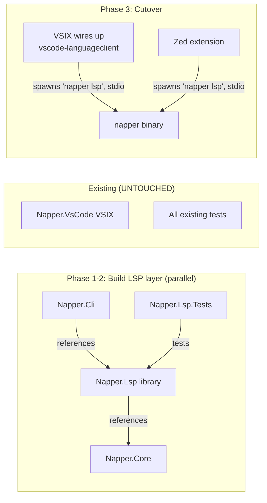
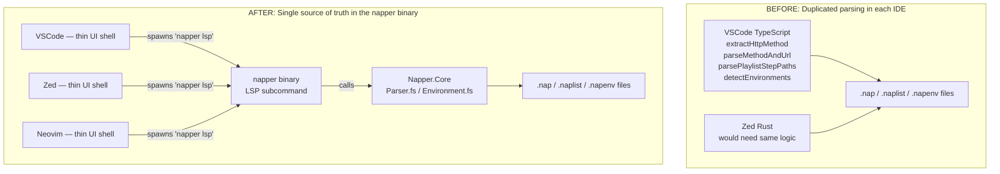
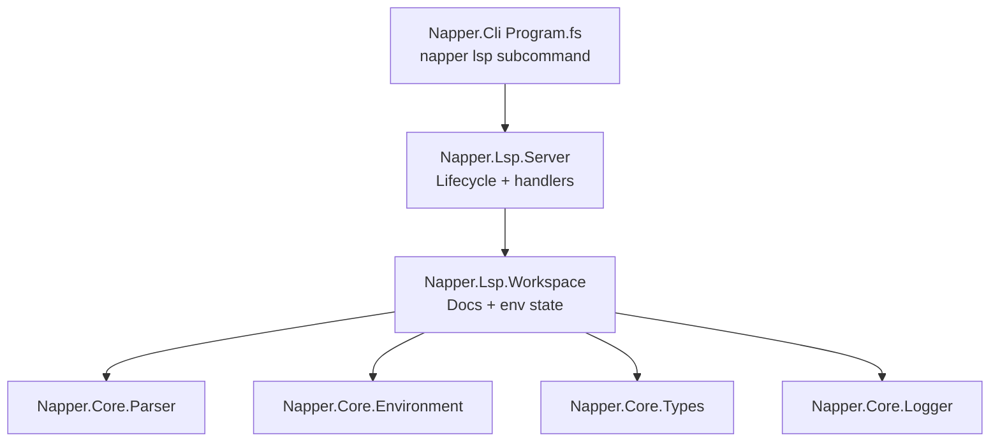

# Nap Language Server — Implementation Plan

The LSP is **a subcommand of `napper`**, not a separate binary. The F# project `Napper.Lsp` is a library (no `OutputType=Exe`, no `Program.fs`) referenced by `Napper.Cli`. When the user runs `napper lsp`, the CLI entry point hands stdio to the LSP layer. **One binary, one install, one version.** See [`lsp-one-binary`](../specs/LSP-SPEC.md#lsp-one-binary).

LSP handler code contains ONLY protocol adapters — all parsing, types, environment resolution, and logging come from `Napper.Core`, the same shared library used by every CLI subcommand. **Zero duplicated domain logic. Period.**

---

## ⛔️ DO NOT BREAK EXISTING FUNCTIONALITY

The LSP layer is built incrementally inside the existing solution. It does NOT touch the existing VSIX, CLI subcommands, or tests except via the explicit `napper lsp` subcommand wire-up.

- **DO NOT modify any existing TypeScript files in `src/Napper.VsCode/`** outside the LSP cutover phase.
- **DO NOT modify any existing F# files in `src/Napper.Core/` or `src/Napper.Cli/`** beyond (a) adding the `lsp` subcommand dispatch in `Napper.Cli/Program.fs` and (b) adding new public functions in `Napper.Core` for LSP consumption. Existing signatures and behaviour stay untouched.
- **DO NOT modify or delete any existing tests**.
- **ALL existing tests MUST continue to pass at all times**.
- **The cutover happens ONLY after the LSP layer is stable and its own tests pass**.

If you need to add a function to `Napper.Core` for the LSP, that's fine — but it's an ADDITION, not a modification.

---

## Strategy: Build Parallel, Cut Across Clean

The goal is to **move logic OUT of TypeScript/Rust and INTO F#**. The VSIX currently reimplements parsing logic that already exists in `Napper.Core`. After cutover, the VSIX becomes a thin UI shell — it asks the LSP for data and renders it. Same for Zed. Same for Neovim. **Less TypeScript, less Rust, MORE F#.**



---

## What the VSIX Does TODAY That Belongs in the LSP

The VSIX currently **reimplements parsing logic in TypeScript** that already exists in `Napper.Core` F#. This is duplicated code that MUST move to the LSP so all IDEs share it.

| VSIX Logic (TypeScript) | What it does | Where it should live | Napper.Core function |
|------------------------|-------------|---------------------|---------------------|
| `explorerProvider.ts:54-68` `extractHttpMethod` | Parses `.nap` file to find HTTP method | **LSP** — document symbols / custom request | `Parser.parseNapFile` (already exists) |
| `curlCopy.ts:59-68` `parseMethodAndUrl` | Parses `.nap` file to extract method + URL | **LSP** — custom request `napper/requestInfo` | `Parser.parseNapFile` (already exists) |
| `explorerProvider.ts:120-136` `parsePlaylistStepPaths` | Parses `.naplist` to extract step file paths | **LSP** — document symbols / custom request | `Parser.parseNapList` (already exists) |
| `environmentSwitcher.ts:8-39` `detectEnvironments` | Scans `.napenv.*` files to list environment names | **LSP** — custom request `napper/environments` | `Environment.fs` (needs new function) |
| `curlCopy.ts:70-82` curl generation | Builds `curl -X METHOD 'URL'` string | **Napper.Core** — new `CurlGenerator` module | Does not exist yet — add to Core |
| `codeLensProvider.ts:44-68` section detection | Finds `[request]` and shorthand lines for CodeLens | **LSP** — document symbols gives this for free | `Parser.parseNapFile` (already exists) |

After cutover, the VSIX TypeScript code for all of the above gets **deleted** and replaced with LSP calls. The Zed extension and Neovim get the same data without writing a single line of TypeScript or Rust parsing code.



---

## Project Structure

`Napper.Lsp` is a **library** (no `OutputType=Exe`, no `Program.fs`) referenced by `Napper.Cli`. The single executable is `napper`. The CLI entry point dispatches `napper lsp` to a `Napper.Lsp.Server.start` function that takes over stdio.

```
src/Napper.Lsp/
├── Napper.Lsp.fsproj       # Library. References Napper.Core, depends on Ionide.LanguageServerProtocol
├── Client.fs               # LSP client wrapper for notifications back to IDE
├── Server.fs               # LSP server — lifecycle, document sync, symbols, custom requests
└── Workspace.fs            # Workspace state: open documents, loaded environments

src/Napper.Cli/
├── Napper.Cli.fsproj       # References Napper.Core AND Napper.Lsp
└── Program.fs              # Entry point. 'napper lsp' subcommand calls Napper.Lsp.Server.start
```



---

## ⚠️ Code Sharing with Napper.Core — MANDATORY

**`Napper.Lsp` contains ONLY LSP protocol glue.** All domain logic lives in `Napper.Core` and is shared with every CLI subcommand. If the LSP needs a capability that doesn't exist in `Napper.Core` yet, ADD IT TO `Napper.Core` — do NOT put it in `Napper.Lsp`. This is non-negotiable.

The rule is simple: **if it's not LSP protocol code, it goes in `Napper.Core`.**

Examples of what belongs where:
- Parsing a `.nap` file → `Napper.Core.Parser` (already exists)
- Extracting variable names from a parsed file → `Napper.Core` (add if missing)
- Mapping a parse error to an LSP Diagnostic → `Napper.Lsp` (protocol glue)
- Scanning for `{{variables}}` in a string → `Napper.Core` (already exists in Environment.fs)
- Generating a curl command → `Napper.Core` (add new module)
- Listing environment names → `Napper.Core.Environment` (add new function)
- Formatting an LSP CompletionItem → `Napper.Lsp` (protocol glue)
- Dispatching `napper lsp` subcommand → `Napper.Cli/Program.fs` (CLI glue)

| Napper.Core Module | LSP Usage |
|-------------------|-----------|
| `Parser.parseNapFile` | Document symbols, request info, CodeLens data, diagnostics |
| `Parser.parseNapList` | Document symbols, step listing, diagnostics |
| `Environment.parseEnvFile` | Variable completions, hover values |
| `Environment.resolveVars` | Hover display |
| `Environment.loadEnvironment` | Variable diagnostics |
| `Environment.detectEnvironments` | **NEW** — list available env names for IDE switcher |
| `CurlGenerator.toCurl` | **NEW** — generate curl command from parsed request |
| `Types.*` | All handlers |
| `Logger.*` | All handlers |

---

## Implementation Phases

### Phase 1 — Library Scaffold + Document Sync

Set up the F# library project, wire up JSON-RPC over stdio, and implement document synchronization. **No existing code is modified except adding the `Napper.Lsp` project to `Napper.slnx`.**

- Create `Napper.Lsp.fsproj` as a **library** (`<OutputType>` removed) referencing `Napper.Core` and `Ionide.LanguageServerProtocol`
- Add project to `Napper.slnx`
- Implement `Server.fs` — `initialize`/`initialized`/`shutdown` handlers, capability advertisement, exposed as `Server.start : Stream -> Stream -> int`
- Implement `Workspace.fs` — in-memory document store (`didOpen`, `didChange`, `didClose`)
- Verify the library builds; integration tests in `Napper.Lsp.Tests` drive `Server.start` directly with in-process pipes

### Phase 2 — Shared Features + Tests

Build the LSP features that REPLACE duplicated TypeScript/Rust logic. These are not new features — they are existing VSIX capabilities moved to F# so all IDEs share them. Also: thorough integration tests over JSON-RPC stdio.

**Document Symbols** — replaces `extractHttpMethod`, `parsePlaylistStepPaths`, and CodeLens section detection in TypeScript:
- `textDocument/documentSymbol` for `.nap` files — sections with line ranges, HTTP method + URL
- `textDocument/documentSymbol` for `.naplist` files — sections with step listing

**Custom LSP Requests** — replaces `parseMethodAndUrl`, `detectEnvironments` in TypeScript:
- `napper/requestInfo` — given a `.nap` file URI, return `{ method, url, headers }` (parsed by `Napper.Core.Parser`)
- `napper/environments` — scan workspace for `.napenv.*` files, return list of environment names
- `napper/curlCommand` — given a `.nap` file URI, return the curl command string

**Napper.Core additions** (shared with every CLI subcommand):
- `Environment.detectEnvironmentNames` — scan a directory for `.napenv.*` files and return env names
- `CurlGenerator.toCurl` — generate curl string from a `NapRequest`

**Tests** — every test runs `Napper.Lsp.Server.start` against in-process pipes (or shells out to `napper lsp` once Phase 2.5 lands) and talks JSON-RPC:
- All Phase 1 lifecycle tests (already done)
- Test: `textDocument/documentSymbol` returns sections for valid `.nap` file
- Test: `textDocument/documentSymbol` returns sections for valid `.naplist` file
- Test: `napper/requestInfo` returns method + URL from parsed `.nap` file
- Test: `napper/environments` returns env names from workspace
- Test: `napper/curlCommand` returns correct curl string
- **ALL existing F# tests still pass**
- **ALL existing VSIX e2e tests still pass**

### Phase 2.5 — `napper lsp` Subcommand

Wire the LSP layer into the CLI entry point so `napper lsp` is a real command users (and IDE extensions) can launch.

- `Napper.Cli.fsproj` adds a project reference to `Napper.Lsp`
- `Napper.Cli/Program.fs` matches `lsp` as a subcommand, calls `Napper.Lsp.Server.start (Console.OpenStandardInput()) (Console.OpenStandardOutput())`
- `Napper.Cli` MUST NOT print anything to stdout when `lsp` is the active subcommand — every log line goes to stderr or to a file. The CLI's banner / `--verbose` output is suppressed for `lsp`.
- `napper help` lists `lsp` as a valid subcommand: `napper lsp     Run the language server (LSP 3.17 over stdio)`
- A `Napper.Cli.Tests` integration test spawns `napper lsp` as a subprocess, sends an `initialize` request over stdin, and asserts the `initialize` response on stdout
- **Delete `Napper.Lsp/Program.fs`** if it still exists from earlier scaffolding
- **Delete the `napper-lsp` `AssemblyName` and `OutputType=Exe`** from `Napper.Lsp.fsproj`

### Phase 3 — Cutover (VSIX + Zed Wire Up)

**Only after Phase 2.5 is complete and all tests pass.**

- Add `vscode-languageclient` dependency to VSIX
- Wire up VSIX to launch `<resolved-napper-path> lsp` over stdio on activation. The resolved path comes from [`vscode-cli-acquisition`](../specs/IDE-EXTENSION-SPEC.md#vscode-cli-acquisition); no separate LSP discovery
- Zed extension: implement `language_server_command` in `lib.rs` to launch `napper lsp`
- **DELETE** duplicated TypeScript parsing code (`extractHttpMethod`, `parseMethodAndUrl`, `parsePlaylistStepPaths`, `detectEnvironments`) — replace with LSP calls
- Verify: existing VSIX features work exactly as before (now powered by LSP)
- **Run ALL existing VSIX e2e tests — every single one must pass**
- **Run ALL existing F# tests — must pass**

### Phase 4 — Post-Cutover: New LSP Features

These are genuinely NEW capabilities that don't exist in any IDE today.

- Diagnostics (`Diagnostics.fs`) — parse errors, unknown variables, missing blocks
- Completions (`Completions.fs`) — HTTP methods, headers, variables, status codes, operators
- Hover (`Hover.fs`) — variable resolution, section descriptions, secret masking
- Configuration — `workspace/didChangeConfiguration` for environment name and mask settings
- File watching — `.napenv` changes trigger revalidation

Each feature gets its own LSP integration tests (same approach: real `napper lsp` subprocess, real JSON-RPC, real assertions).

---

## Testing Strategy

**No unit tests. No mocks. LSP integration tests ONLY.**

Every test:
1. Spawns `napper lsp` as a subprocess (or, in early Phase 1/2, drives `Napper.Lsp.Server.start` directly with in-process pipes)
2. Sends LSP JSON-RPC messages over stdin (the exact same protocol VSCode/Zed use)
3. Reads LSP JSON-RPC responses from stdout
4. Asserts on the responses

This is the same communication path the real IDEs use. If the tests pass, the IDEs work.

- **Napper.Core tests already cover** parsing, environment resolution, and types — do NOT re-test those.
- **Existing VSIX e2e tests**: Must pass before AND after cutover. These are the acceptance criteria.
- **Existing F# tests**: Must pass at all times. Run them before every change.

---

## Dependencies

| Package | Purpose |
|---------|---------|
| `Ionide.LanguageServerProtocol` | LSP types and JSON-RPC server framework |
| `Napper.Core` (project ref) | Parser, types, environment, logger |

No other dependencies. The LSP is lightweight by design.

---

## TODO

### Phase 1 — Library Scaffold + Document Sync
- [x] Create `Napper.Lsp.fsproj` with `Napper.Core` project reference
- [x] Add `Ionide.LanguageServerProtocol` package reference
- [x] Add `Napper.Lsp` to `Napper.slnx`
- [x] Implement `Program.fs` — stdio transport and server lifecycle (will move to `Napper.Cli/Program.fs` in Phase 2.5)
- [x] Implement `Server.fs` — initialize/shutdown, capability registration
- [x] Implement `Workspace.fs` — document store (didOpen/didChange/didClose)

### Phase 2 — Shared Features + Tests
- [x] Create `Napper.Lsp.Tests` project
- [x] Test: initialize handshake (JSON-RPC over stdio)
- [x] Test: initialized notification
- [x] Test: textDocument/didOpen
- [x] Test: textDocument/didChange
- [x] Test: textDocument/didClose
- [x] Test: shutdown + exit lifecycle
- [x] Test: malformed JSON-RPC handled gracefully
- [x] Test: unknown method returns LSP error
- [x] Verify all existing projects build (zero warnings, zero errors)
- [x] Add `SectionScanner` to `Napper.Core` (section positions for document symbols)
- [x] Add `Environment.detectEnvironmentNames` to `Napper.Core`
- [x] Add `CurlGenerator.toCurl` to `Napper.Core`
- [x] Implement `textDocument/documentSymbol` for `.nap` files (sections + method + URL)
- [x] Implement `textDocument/documentSymbol` for `.naplist` files (sections + steps)
- [x] Implement `textDocument/codeLens` for `.nap` files (request section detection)
- [x] Implement `workspace/executeCommand` `napper.requestInfo` (method, URL, headers)
- [x] Implement `workspace/executeCommand` `napper.copyCurl` (curl string)
- [x] Implement `workspace/executeCommand` `napper.listEnvironments` (env names)
- [x] Test: documentSymbol returns sections for `.nap` file
- [x] Test: documentSymbol returns sections for `.naplist` file
- [x] Test: codeLens returns lenses for `.nap` file
- [x] Test: `napper.requestInfo` returns parsed method + URL
- [x] Test: `napper.copyCurl` returns curl string
- [x] Test: `napper.listEnvironments` returns env names
- [ ] Verify ALL existing F# tests pass
- [ ] Verify ALL existing VSIX e2e tests pass

### Phase 2.5 — `napper lsp` Subcommand
- [ ] Convert `Napper.Lsp.fsproj` from executable to library: remove `<OutputType>Exe</OutputType>` and the `napper-lsp` `<AssemblyName>`
- [ ] Delete `src/Napper.Lsp/Program.fs` (its logic moves into the CLI entry point)
- [ ] Expose `Napper.Lsp.Server.start : Stream -> Stream -> int` as the public entry point used by both CLI dispatch and tests
- [ ] Add `Napper.Lsp` project reference to `src/Napper.Cli/Napper.Cli.fsproj`
- [ ] Add `lsp` subcommand dispatch in `src/Napper.Cli/Program.fs` that calls `Napper.Lsp.Server.start`
- [ ] Suppress all stdout output from the CLI when `lsp` is the active subcommand (logs go to stderr or file)
- [ ] Update `napper help` to list `napper lsp`
- [ ] Add a `Napper.Cli.Tests` integration test that spawns `napper lsp`, sends `initialize`, and asserts the response
- [ ] Update `Napper.Lsp.Tests` to drive `Server.start` directly via in-process pipes (no subprocess) — this stays the fast unit-ish integration path
- [ ] `napper --version` returns the same version regardless of subcommand

### Phase 3 — Cutover
- [ ] Add `vscode-languageclient` to VSIX
- [ ] Wire VSIX to launch `<resolvedNapperPath> lsp` on activation (path comes from the install resolver — no separate LSP discovery)
- [ ] Wire Zed `language_server_command` to launch `napper lsp`
- [ ] Delete duplicated TS parsing code, replace with LSP calls
- [ ] Verify existing VSIX features unchanged
- [ ] Run ALL existing VSIX e2e tests — must pass
- [ ] Run ALL existing F# tests — must pass

### Phase 4 — Post-Cutover: New LSP Features
- [ ] Diagnostics (parse errors, unknown variables, missing blocks)
- [ ] Completions (methods, headers, variables, status codes, operators)
- [ ] Hover (variable resolution, secret masking, descriptions)
- [ ] Configuration (environment name, mask settings)
- [ ] File watching (.napenv changes)
- [ ] Integration tests for each new feature (JSON-RPC over stdio)
