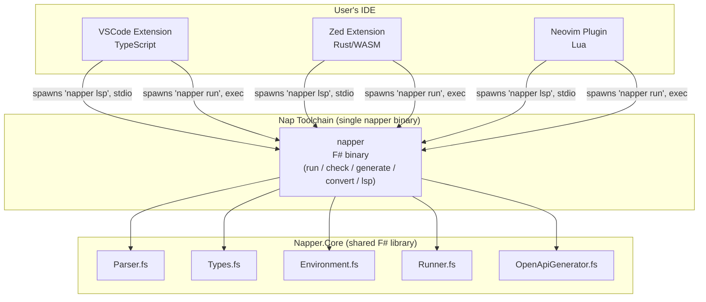
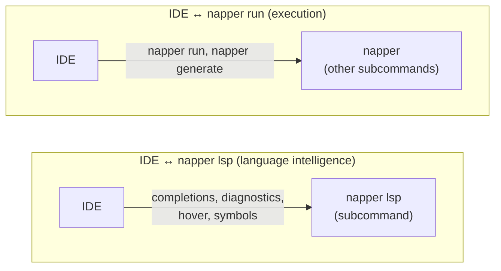

# `ide-extension` — Napper IDE Extension Specification

> The extension is the **primary entry point** for most users. It must be as approachable as Postman on first open, but backed by plain files that work perfectly from the CLI and in CI.

---

## Target IDEs

| IDE | Language | Grammar System | Status |
|-----|----------|---------------|--------|
| **VSCode** (+ Cursor, Windsurf, VSCodium) | TypeScript | TextMate | Primary |
| **Zed** | Rust → WASM | Tree-sitter | Primary |
| **Neovim** | Lua | Tree-sitter | Future |

All extensions shell out to the **Nap CLI** for execution. No IDE extension re-implements the HTTP runner. This keeps every IDE in sync with the CLI.

---

## System Architecture





---

## `vscode-philosophy` — Design Philosophy

- **No separate app.** Everything lives inside the IDE. No webview-based fake browser.
- **Files are always the truth.** The UI is a lens over `.nap` and `.naplist` files. Edits in the UI update the file directly; edits in the file are immediately reflected in the UI. There is no sync step.
- **Progressive disclosure.** A new user can send their first request within 30 seconds of installing. Advanced features (scripting, playlists, environments) reveal themselves naturally as the user explores.
- **Looks good, works fast.** The UI should feel polished — not a dev tool hacked together from tree views and JSON editors.
- **Parity where possible.** Features should be as close as possible across IDEs. Where an IDE lacks a capability, degrade gracefully rather than omit the feature entirely.

---

## `ide-lsp` — Portable Core: Nap Language Server (LSP)

The foundation for cross-IDE feature parity is the **Nap Language Server**, which runs as the **`napper lsp` subcommand** of the `napper` CLI. **One binary, one install** — see [`lsp-one-binary`](./LSP-SPEC.md#lsp-one-binary). IDE extensions spawn `napper lsp` and speak LSP 3.17 over stdio. The LSP layer reuses `Napper.Core` directly (parser, types, environment) with zero duplicated logic.

**The LSP replaces duplicated logic in IDE extensions.** The VSIX currently re-parses `.nap` files in TypeScript to extract HTTP methods, URLs, playlist steps, and environment names. This logic already exists in `Napper.Core` F#. After the LSP cutover, all IDEs ask the LSP for this data instead of reimplementing parsing in their own language. **Less TypeScript, less Rust, MORE F#.**

IDE extensions become **thin UI shells** — they render data from the LSP and handle IDE-specific UI (CodeLens, tree views, status bars). They do NOT parse `.nap` files themselves.

See **[LSP Specification](./LSP-SPEC.md)** for the full capability spec and **[LSP Plan](../plans/LSP-PLAN.md)** for implementation phases.

---

## Feature Matrix: What Ships Where

| Feature | VSCode | Zed | Source |
|---------|--------|-----|--------|
| Syntax highlighting | TextMate grammar | Tree-sitter grammar | IDE-specific grammars, same visual result |
| Document symbols (outline) | LSP | LSP | **LSP** — `textDocument/documentSymbol` via `Napper.Core.Parser` |
| Request info (method + URL) | LSP | LSP | **LSP** — `napper/requestInfo` via `Napper.Core.Parser` |
| Copy as curl | LSP | LSP | **LSP** — `napper/curlCommand` via `Napper.Core.CurlGenerator` |
| Environment listing | LSP | LSP | **LSP** — `napper/environments` via `Napper.Core.Environment` |
| Completions | LSP | LSP | **LSP** — `textDocument/completion` |
| Diagnostics | LSP | LSP | **LSP** — `textDocument/publishDiagnostics` |
| Hover | LSP | LSP | **LSP** — `textDocument/hover` |
| Run request | CodeLens `▶ Run` | Runnables via `runnables.scm` | IDE-specific UI, both shell out to CLI |
| Sidebar panel | Tree view in Activity Bar | Not available | VSCode-only |
| Response viewer | Webview panel | Not available | VSCode-only; Zed uses terminal |
| Test Explorer | `vscode.TestController` | Not available | VSCode-only |
| Environment switcher UI | Status bar + quick-pick | CLI `--env` flag | IDE-specific UI; **data from LSP** |
| New request flow | Quick-input wizard | Not available | VSCode-only |
| Commands | Command Palette | Slash commands | IDE-specific entry points |
| AI enrichment (OpenAPI) | VS Code LM API | Zed Assistant | IDE-specific AI integration |

---

## Shared Behaviour (All IDEs)

### `vscode-syntax` — Syntax Highlighting

Full grammar-aware highlighting for `.nap` and `.naplist` files. Both grammars must produce visually identical results.

**VSCode:** TextMate grammar (`.tmLanguage.json`).
**Zed:** Tree-sitter grammar with `highlights.scm`, `brackets.scm`, `outline.scm`, `indents.scm` query files.

Both grammars highlight:
- Section headers (`[meta]`, `[request]`, `[assert]`, `[script]`, `[vars]`, `[steps]`)
- Keys and values
- `{{variable}}` interpolation
- HTTP methods (`GET`, `POST`, etc.)
- Comments (`#`)
- String literals
- Assertion operators (`exists`, `matches`, `contains`, `<`, `=`)

### `vscode-codelens` — Run Actions

Every IDE must support running a `.nap` file or `.naplist` file from within the editor.

**VSCode:** CodeLens actions appear above relevant lines:
- `▶ Run` above `[request]`
- `▶ Run Playlist` above `[meta]` in `.naplist` files
- `⧉ Copy as curl` above `[request]`

**Zed:** Runnables via `runnables.scm` detect `[request]` blocks and offer "Run" in the editor gutter. The runnable executes `nap run <file>` and streams output to the terminal.

### Language Intelligence (via LSP)

All IDEs connect to the Nap Language Server by spawning `napper lsp` and speaking JSON-RPC 2.0 over stdio. The LSP provides completions, diagnostics, hover, and document symbols. See **[LSP Specification](./LSP-SPEC.md)** for the full details.

---

## VSCode-Only Features

These features rely on VSCode APIs that have no equivalent in Zed or Neovim.

### `vscode-layout` — Layout Overview

The extension contributes a dedicated **Nap Activity Bar icon** (sidebar panel). The panel has two tabs:

```
┌─────────────────────────────┐
│  Nap                  [+ v] │  <- panel header: new request button, env picker
├──────────┬──────────────────┤
│ Explorer │ Playlists        │  <- two tabs
├──────────┴──────────────────┤
│                             │
│  my-api/                    │  <- folder = collection
│    auth/                    │
│      01_login               │  <- .nap file
│      02_refresh-token       │
│    users/                   │
│      01_get-user       pass │  <- pass indicator
│      02_create-user    fail │  <- fail indicator
│      03_delete-user         │
│                             │
│  smoke            [> Run]   │  <- .naplist file
└─────────────────────────────┘
```

### `vscode-explorer` — Explorer Tab

The Explorer tab mirrors the folder structure on disk, filtered to `.nap`, `.naplist`, and `.napenv` files.

**Each `.nap` file node shows:**
- File name (without extension, prettified)
- HTTP method badge (`GET`, `POST`, etc.) in a colour-coded pill
- Last run result icon: pass / fail / pending / skipped
- Hover: URL, last run time, last status code

**Context menu on a `.nap` file:**
- Run
- Copy as curl
- Open in editor
- Add to playlist
- Duplicate
- Delete

**Folder (collection) context menu:**
- Run all
- New request here
- New playlist here

### `vscode-playlists` — Playlists Tab

Lists all `.naplist` files found in the workspace, with a tree showing their step structure (including nested playlists). Each playlist node has a Run button. Individual steps can be run in isolation.

### `vscode-editor` — Request Editor (split view)

Clicking a `.nap` file opens it in a **split editor**: the raw `.nap` file on the left (editable), and a structured **Request Panel** on the right as a webview.

```
┌─────────────────────────┬──────────────────────────────────────┐
│  get-user.nap           │  Get user by ID              [> Run] │
│─────────────────────────│──────────────────────────────────────│
│ [meta]                  │  -- Request ----------------------  │
│ name = "Get user by ID" │  GET  https://api.ex.../users/42    │
│                         │                                      │
│ [request]               │  Headers                         [+] │
│ method = GET            │  Authorization  Bearer ******        │
│ url = {{baseUrl}}/...   │  Accept         application/...      │
│                         │  ----------------------------------- │
│ [assert]                │                                      │
│ status = 200            │  -- Response ---------------------   │
│ body.id exists          │  200 OK   47ms   1.2 KB              │
│                         │                                      │
│                         │  Headers   Body   Preview            │
│                         │  {                                   │
│                         │    "id": "42",                       │
│                         │    "name": "Alice"                   │
│                         │  }                                   │
│                         │                                      │
│                         │  Assertions                          │
│                         │  pass status = 200                   │
│                         │  pass body.id exists                 │
└─────────────────────────┴──────────────────────────────────────┘
```

**The right panel is read-only** — a live preview of the request and (after running) the response. All editing is done in the `.nap` file on the left. The two sides stay in sync automatically.

**Response sub-tabs:**
- **Body** — raw or pretty-printed JSON/XML/text with syntax highlighting and search
- **Headers** — response headers as a clean key/value table
- **Preview** — rendered HTML (for HTML responses) or image (for image responses)

**Assertions section** (below the response): each assertion from the `[assert]` block is listed with its pass/fail state and the actual vs. expected value on failure.

### `vscode-env-switcher` — Environment Switcher

A **status bar item** (bottom-left) shows the active environment:

```
[ Nap: staging v ]
```

Clicking opens a quick-pick dropdown listing all detected environments (from `.napenv.*` files). Switching environment immediately re-resolves all variable previews in open editors.

A per-workspace setting `nap.defaultEnvironment` can be committed to the repo to set the team default.

### `vscode-new-request` — New Request Flow

Clicking **[+]** in the panel header (or running the `Nap: New Request` command) opens a guided quick-input flow:

1. **Pick HTTP method** — GET / POST / PUT / PATCH / DELETE / HEAD / OPTIONS
2. **Enter URL** — with autocomplete for `{{baseUrl}}` and other known variables
3. **Pick destination folder** — from the workspace collection tree
4. **Name the request** — defaults to `{method} {path}` (e.g. `GET users-userId`)

The file is created immediately and opened in the split editor, ready to run.

### `vscode-test-explorer` — Test Explorer Integration

The extension registers a `vscode.TestController` so all `.nap` files appear in the standard VSCode **Test Explorer** panel (the flask icon in the activity bar).

- Collections map to **test suites**
- `.nap` files map to **test items**
- `.naplist` files map to a **test suite** with each step as a child item
- Nested playlists are nested suites

Run/debug actions in the Test Explorer invoke the Nap CLI under the hood (`nap run <file> --output junit`) and map results back to the test items.

Results are shown in the **Test Results** output panel with:
- Full request (method, URL, headers, body)
- Full response (status, headers, body)
- Each assertion result with actual vs. expected values on failure
- Script output (`ctx.Log` messages) shown as test output

---

## Zed-Only Features

### Runnables

Zed's `runnables.scm` detects `[request]` blocks in `.nap` files and offers a gutter "Run" action. The runnable executes `nap run <file>` and streams output to the Zed terminal panel. Environment variables from `runnables.scm` captures (prefixed `ZED_CUSTOM_`) can pass context.

### Slash Commands (Assistant Integration)

Zed extensions can register slash commands for the Zed Assistant:

- `/nap-run <file>` — run a `.nap` file and return the result in the Assistant context
- `/nap-import-openapi <file>` — generate `.nap` files from an OpenAPI spec

### Text Redactions

Zed supports `redactions.scm` to mask sensitive values during screen sharing. The Nap grammar should redact `{{variable}}` values sourced from `.napenv.local`.

---

## `vscode-settings` — Extension Settings

These settings apply across all IDEs where the extension supports configuration.

| Setting | Default | Description | IDEs |
|---------|---------|-------------|------|
| `nap.defaultEnvironment` | `""` | Active environment name | All (VSCode via settings, Zed/Neovim via CLI flag) |
| `nap.autoRunOnSave` | `false` | Re-run the request when the file is saved | VSCode |
| `nap.splitEditorLayout` | `"beside"` | `"beside"` or `"below"` for the response panel | VSCode |
| `nap.maskSecretsInPreview` | `true` | Mask variables sourced from `.napenv.local` in hover tooltips | All (via LSP) |
| `nap.cliPath` | `"nap"` | Path to the Nap CLI binary (auto-detected if on PATH) | All |

---

## `vscode-commands` — Extension Commands

### VSCode (Command Palette)

| Command | Description |
|---------|-------------|
| `Nap: New Request` | Create a new `.nap` file via guided flow |
| `Nap: New Playlist` | Create a new `.naplist` file |
| `Nap: Run File` | Run the currently open `.nap` or `.naplist` |
| `Nap: Run All` | Run all `.nap` files in the workspace |
| `Nap: Switch Environment` | Open environment picker |
| `Nap: Copy as curl` | Copy the current request as a curl command |
| `Nap: Generate from OpenAPI` | Run `nap generate openapi` against a spec file |
| `Nap: Reveal in Explorer` | Jump from the Nap panel to the file in the native Explorer |

### Zed (Slash Commands)

| Command | Description |
|---------|-------------|
| `/nap-run` | Run a `.nap` file and return results in Assistant |
| `/nap-import-openapi` | Generate `.nap` files from an OpenAPI spec |

---

## `vscode-impl` — Implementation Notes

### VSCode

- Built in **TypeScript** using the VSCode Extension API.
- The response panel webview uses a minimal framework (Lit or vanilla TS + CSS) — no heavy UI library.
- The extension shells out to the **Nap CLI** (`nap run --output json`) for all HTTP execution.
- **CLI acquisition:** see [`vscode-cli-acquisition`](#vscode-cli-acquisition) below.
- File watching via `vscode.workspace.createFileSystemWatcher` keeps the panel tree up to date without polling.
- The `.nap` language grammar (TextMate `.tmLanguage.json`) is generated from the ANTLR grammar to avoid drift.
- Published to the **VS Code Marketplace** and the **Open VSX Registry** (for VSCodium / Cursor / Windsurf users).

#### `vscode-cli-acquisition` — CLI install resolution

The extension uses `@nimblesite/shipwright-vscode` (`activateDeploymentToolkit`) on activation. It reads `deployment-toolkit.json` from the extension root and resolves the napper CLI binary via the following source chain (first match wins):

1. **`vscode-cli-acq-user-setting`** — VS Code setting `napper.cliPath` points to a valid binary of the correct version → done.
2. **`vscode-cli-acq-env`** — Env var `NAPPER_PATH` (full path) or `NAPPER_BINARY_DIR` (directory) resolves to a valid binary → done.
3. **`vscode-cli-acq-bundled`** — **Bundled binary** at `bin/${platform}/napper[.exe]` inside the installed extension directory (e.g. `~/.vscode/extensions/nimblesite.napper-0.11.0/bin/darwin-arm64/napper`). This is the primary resolution path for all Marketplace installs. The binary is self-contained — no .NET runtime required on the host.
4. **`vscode-cli-acq-path`** — `napper` on the system `$PATH` with a matching version → done.
5. **`vscode-cli-acq-dotnet-tool`** — `dotnet tool` global install of the `napper` package → done.

`vscode-cli-acq-version` — The CLI version MUST exactly match `product.version` in `deployment-toolkit.json`, which MUST match the VSIX `package.json` version. On mismatch, the extension shows a hard error and refuses to start (`onMismatch: "error"`).

`vscode-cli-acq-per-platform` — Each per-platform VSIX contains exactly one binary for its target platform. The VS Code Marketplace delivers the correct VSIX for the user's OS and architecture automatically. There is no runtime binary download.

`vscode-cli-acq-tap-coexist` — Users can `brew install napper` / `scoop install napper` via [`Nimblesite/homebrew-tap`](https://github.com/Nimblesite/homebrew-tap) and [`Nimblesite/scoop-bucket`](https://github.com/Nimblesite/scoop-bucket). If the version matches, source 4 (`path`) resolves it. If not, the bundled binary (source 3) wins.

### Zed

- Built in **Rust**, compiled to **WebAssembly** via `zed_extension_api` crate.
- Tree-sitter grammar for `.nap` and `.naplist` (separate from the TextMate grammar — tree-sitter is more expressive for structural queries).
- LSP integration: the extension declares the Nap Language Server in `extension.toml` and implements `language_server_command` to launch it.
- Published via the **zed-industries/extensions** GitHub repository.
- No webviews, no sidebar panels, no test explorer — these are VSCode-only. Zed users get syntax highlighting, LSP intelligence, and runnables.

### Shared

- All extensions shell out to `nap run` for execution. No IDE re-implements HTTP logic.
- All extensions launch the LSP by spawning `napper lsp` over stdio. See **[LSP Specification](./LSP-SPEC.md)**.
- Grammar definitions (TextMate and Tree-sitter) are both derived from the same ANTLR `.g4` grammar to prevent drift.

---

## Related Specs

- [LSP Specification](./LSP-SPEC.md) — Language server capabilities, architecture, and protocol details
- [LSP Plan](../plans/LSP-PLAN.md) — LSP implementation phases and TODO
- [IDE Extension Plan (VSCode)](../plans/IDE-EXTENSION-PLAN.md) — VSCode implementation phases and TODO
- [IDE Extension Install Plan](../plans/IDE-EXTENSION-INSTALL-PLAN.md) — VSIX CLI install resolver
- [IDE Extension Plan (Zed)](../plans/ZED-EXTENSION-PLAN.md) — Zed implementation phases and TODO
- [OpenAPI Generation (Extension)](./IDE-EXTENION-OPENAPI-GENERATION-SPEC.md) — Import command and AI enrichment
