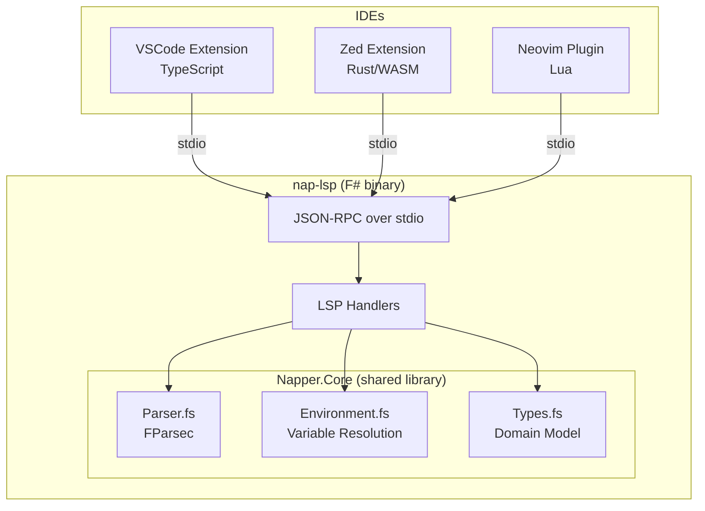
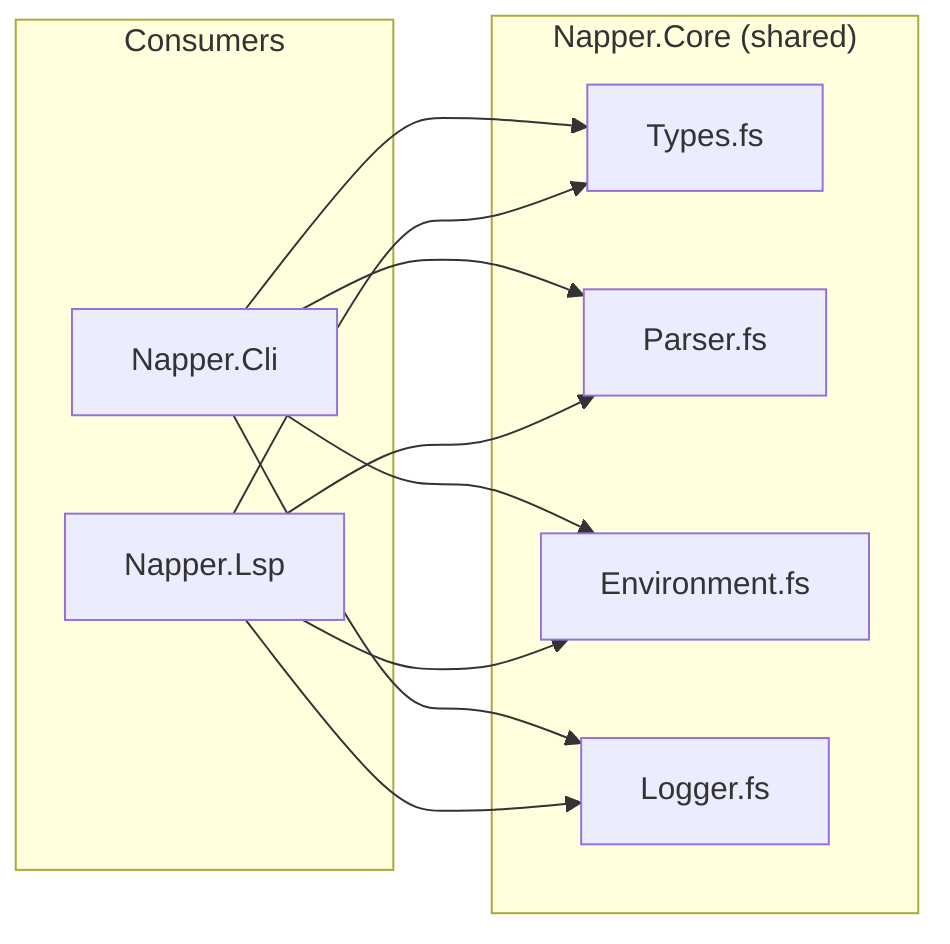

# Nap Language Server — Specification

> A standalone LSP binary that provides language intelligence for `.nap`, `.naplist`, and `.napenv` files across all IDEs. Built in F#, reusing **Napper.Core** modules directly.

---

## Architecture

---

## Design Principles

- **⚠️ ZERO duplicated logic — this is the #1 rule.** `Napper.Lsp` MUST NOT contain any parsing, type definitions, environment resolution, or domain logic. ALL of that lives in `Napper.Core`. The LSP is a thin protocol adapter that calls `Napper.Core` functions and translates results to LSP responses. If you find yourself writing domain logic in `Napper.Lsp`, STOP — it belongs in `Napper.Core` where the CLI can use it too.
- **Napper.Core is the single source of truth.** `Napper.Cli` and `Napper.Lsp` are both thin consumers of `Napper.Core`. They share the exact same parser, types, environment resolution, and logger. Any new capability needed by the LSP that could be useful to the CLI MUST be added to `Napper.Core`, not to `Napper.Lsp`.
- **Standalone binary.** Published as a self-contained `nap-lsp` executable via `dotnet publish`. No .NET runtime required on the user's machine.
- **Protocol-only coupling.** IDE extensions communicate exclusively via LSP over stdio. No IDE-specific code in the LSP binary.
- **Incremental.** Each LSP capability ships independently. The server advertises only what it supports.

---

## Transport

| Property | Value |
|----------|-------|
| Transport | stdio (stdin/stdout) |
| Protocol | JSON-RPC 2.0 (LSP 3.17) |
| Encoding | UTF-8 |
| Binary name | `nap-lsp` |

IDE extensions launch `nap-lsp` as a child process and communicate over stdin/stdout. No TCP, no WebSocket, no HTTP.

---

## ⚠️ The LSP Replaces Duplicated IDE Logic

The VSIX currently reimplements `.nap` file parsing in TypeScript — extracting HTTP methods, URLs, playlist steps, and environment names. This is **duplicated logic** that already exists in `Napper.Core` F#. The LSP eliminates this duplication: all IDEs ask the LSP, the LSP calls `Napper.Core`, done. **Less TypeScript, less Rust, MORE F#.**

| Duplicated VSIX Logic | Replaced By |
|-----------------------|-------------|
| `extractHttpMethod` (TS) — re-parses `.nap` to find method | `textDocument/documentSymbol` — LSP parses once via `Napper.Core.Parser` |
| `parseMethodAndUrl` (TS) — re-parses `.nap` for curl copy | `napper/requestInfo` — custom LSP request |
| `parsePlaylistStepPaths` (TS) — re-parses `.naplist` for steps | `textDocument/documentSymbol` — LSP parses via `Napper.Core.Parser` |
| `detectEnvironments` (TS) — scans `.napenv.*` files | `napper/environments` — custom LSP request |
| CodeLens section detection (TS) — finds `[request]` lines | `textDocument/documentSymbol` — sections with line ranges |

---

## Capabilities

### `lsp-custom` — Custom Requests (Napper-specific)

These are non-standard LSP requests that provide structured data to all IDEs. They replace duplicated parsing logic in TypeScript/Rust.

| Method | Params | Returns | Replaces |
|--------|--------|---------|----------|
| `napper/requestInfo` | `{ uri: string }` | `{ method: string, url: string, headers: Record<string, string> }` | `parseMethodAndUrl` in TS |
| `napper/environments` | `{ rootUri: string }` | `{ environments: string[] }` | `detectEnvironments` in TS |
| `napper/curlCommand` | `{ uri: string }` | `{ curl: string }` | curl generation in TS |

**Implementation:** All three call `Napper.Core` functions — `Parser.parseNapFile`, `Environment.detectEnvironmentNames` (new), `CurlGenerator.toCurl` (new).

### `lsp-completions` — Completions

Triggered on typing within `.nap` and `.naplist` files.

| Context | Completion Items |
|---------|-----------------|
| After `method =` | `GET`, `POST`, `PUT`, `PATCH`, `DELETE`, `HEAD`, `OPTIONS` |
| After `[request.headers]` key position | Common HTTP headers: `Content-Type`, `Authorization`, `Accept`, `Cache-Control`, `User-Agent`, ... |
| Inside `{{` | Variable names from `.napenv` files in the workspace |
| After `status` in `[assert]` | Common HTTP status codes: `200`, `201`, `400`, `401`, `404`, `500`, ... |
| After assertion target | Assertion operators: `=`, `exists`, `contains`, `matches`, `<`, `>` |
| `[steps]` block in `.naplist` | `.nap` and `.naplist` file paths from the workspace |

**Implementation:** Parse the document up to the cursor position using `Napper.Core.Parser`. Determine the current section (`[meta]`, `[request]`, `[assert]`, etc.) and offer context-appropriate items.

### `lsp-diagnostics` — Diagnostics

Published on `textDocument/didOpen` and `textDocument/didChange`.

| Diagnostic | Severity | Condition |
|-----------|----------|-----------|
| Parse error | Error | `Napper.Core.Parser.parseNapFile` returns `Error` |
| Unknown variable | Warning | `{{name}}` referenced but not defined in any `.napenv` file or `[vars]` block |
| Missing `[request]` block | Error | Full `.nap` file has no `[request]` section |
| Invalid assertion syntax | Error | Assertion line doesn't match any known operator pattern |
| Unreachable script path | Warning | `[script]` `pre` or `post` path does not exist on disk |
| Missing step file | Warning | `.naplist` step references a file that doesn't exist |

**Implementation:** Run `Napper.Core.Parser.parseNapFile` or `parseNapList`. For variable diagnostics, scan for `{{...}}` patterns and check against `Napper.Core.Environment.loadEnvironment`. Report diagnostics with line/column positions from FParsec error info.

### `lsp-hover` — Hover

| Hover Target | Display |
|-------------|---------|
| `{{variable}}` | Resolved value from the active environment. If sourced from `.napenv.local`, show `******` (masked). |
| Section header (`[request]`, `[assert]`, etc.) | Brief description of the section's purpose |
| HTTP method keyword | Method description (e.g., "GET — Safe, idempotent retrieval") |
| Assertion operator | Operator description (e.g., "contains — checks if the value includes the substring") |

**Implementation:** Parse the document, locate the token under the cursor, resolve variables using `Napper.Core.Environment`.

### `lsp-symbols` — Document Symbols

Expose file structure for outline navigation (Ctrl+Shift+O in VSCode, symbol search in Zed).

| Symbol | Kind | Scope |
|--------|------|-------|
| `[meta]` | `Namespace` | `.nap`, `.naplist` |
| `[request]` | `Function` | `.nap` |
| `[request.headers]` | `Struct` | `.nap` |
| `[request.body]` | `Struct` | `.nap` |
| `[assert]` | `Function` | `.nap` |
| `[script]` | `Function` | `.nap` |
| `[vars]` | `Variable` | `.nap`, `.naplist` |
| `[steps]` | `Array` | `.naplist` |

**Implementation:** Walk the parsed AST from `Napper.Core.Parser` and emit `DocumentSymbol` entries with line ranges.

---

## File Watching

The LSP watches the workspace for changes to `.napenv`, `.napenv.*`, and `.napenv.local` files. When these change, the server:

1. Reloads the environment using `Napper.Core.Environment.loadEnvironment`
2. Re-publishes diagnostics for all open `.nap` files (unknown variable warnings may appear or disappear)
3. Updates hover resolution for `{{variable}}` tokens

The server registers `workspace/didChangeWatchedFiles` for these glob patterns:
- `**/.napenv`
- `**/.napenv.*`

---

## Configuration

The LSP accepts configuration via `workspace/didChangeConfiguration` and `initializationOptions`:

| Setting | Type | Default | Description |
|---------|------|---------|-------------|
| `nap.environment` | `string` | `""` | Active environment name (selects `.napenv.{name}`) |
| `nap.maskSecrets` | `bool` | `true` | Mask values from `.napenv.local` in hover |

---

## Supported File Types

| Extension | Language ID | Features |
|-----------|------------|----------|
| `.nap` | `nap` | All capabilities |
| `.naplist` | `naplist` | Completions (steps), diagnostics, symbols |
| `.napenv` | `napenv` | Hover (show which files reference each variable) |

---

## Error Handling

- Parse errors from FParsec are mapped to LSP `Diagnostic` objects with precise line/column positions.
- The server never crashes on malformed input. All handlers catch exceptions and log via `Napper.Core.Logger`.
- If the workspace has no `.napenv` files, variable-related features degrade gracefully (no completions, no hover values, but no errors either).

---

## Distribution

| Platform | Binary | Notes |
|----------|--------|-------|
| macOS (arm64) | `nap-lsp` | Self-contained, single file |
| macOS (x64) | `nap-lsp` | Self-contained, single file |
| Linux (x64) | `nap-lsp` | Self-contained, single file |
| Windows (x64) | `nap-lsp.exe` | Self-contained, single file |

Built with `dotnet publish -c Release -r <rid> --self-contained -p:PublishSingleFile=true`.

IDE extensions discover the binary by:
1. Checking `nap.cliPath` setting (if configured)
2. Looking for `nap-lsp` on `PATH`
3. Downloading from GitHub releases (future)

---

## Related Specs

- [IDE Extension Spec](./IDE-EXTENSION-SPEC.md) — Feature matrix and IDE-specific behaviour
- [IDE Extension Plan (VSCode)](./IDE-EXTENSION-PLAN.md) — VSCode implementation phases
- [Zed Extension Plan](./ZED-EXTENSION-PLAN.md) — Zed implementation phases
- [File Formats Spec](./FILE-FORMATS-SPEC.md) — `.nap`, `.naplist`, `.napenv` format definitions
- [LSP Implementation Plan](./LSP-PLAN.md) — Implementation phases and TODO
